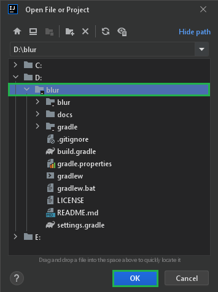
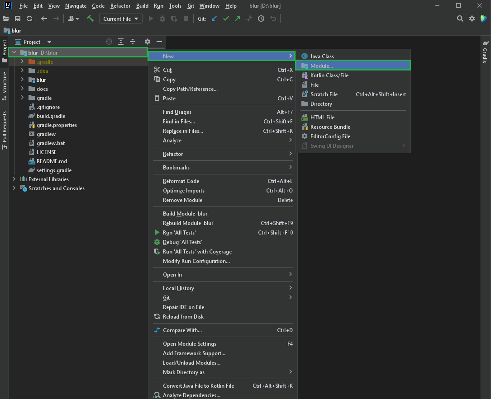
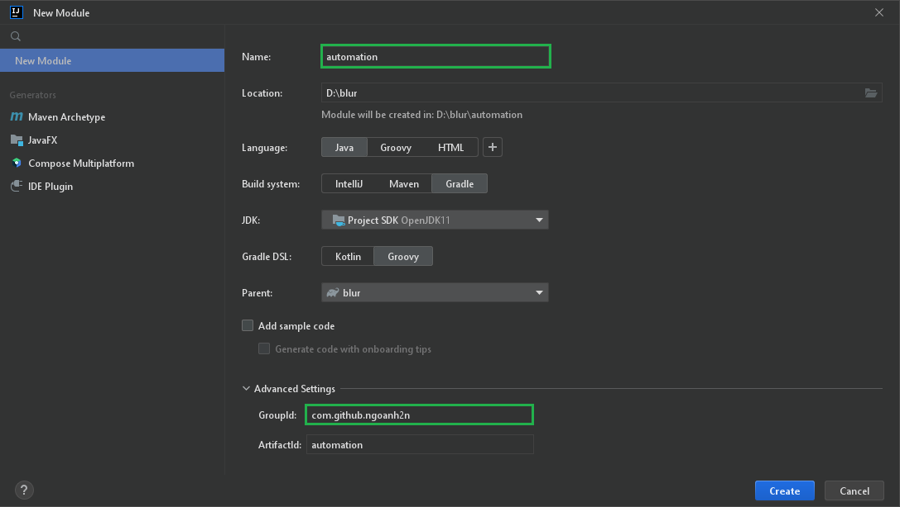

<!-- TOC -->
* [Skeleton](#skeleton)
  * [Clone Repository](#clone-repository)
  * [Open Project<br>](#open-projectbr)
  * [Create Module](#create-module)
  * [Add Dependency](#add-dependency)
<!-- TOC -->

# Skeleton
This skeleton is a Gradle multi-module project.
```
├── gradle
│   ├── test.gradle
│   ├── versions.gradle
│   ├── compilation.gradle
│   ├── publication.gradle
│   ├── dependencies.gradle
│   └── wrapper
│       ├── gradle-wrapper.jar
│       └── gradle-wrapper.properties
├── blur
│   ├── src
│   │   ├── main
│   │   └── test
│   ├── build.gradle
│   └── gradle.properties
├── gradlew
├── gradlew.bat
├── build.gradle
├── settings.gradle
├── gradle.properties
├── LICENSE
├── README.md
└── .gitignore
```

## Clone Repository
> git clone https://github.com/ngoanh2n/blur.git

## Open Project<br>
Assume using IntelliJ IDEA as IDE.

`Projects` > `Open`<br>


## Create Module
- `File` > `New` > `Module`
  
- Enter module information
  

## Add Dependency
At file `automation/build.gradle`.
```gradle
dependencies {
    implementation(project(":blur"))
	...
}

apply from: rootProject.file("gradle/test.gradle")
```

Now you have multi-module project as below.
```
├── gradle
│   ├── test.gradle
│   ├── versions.gradle
│   ├── compilation.gradle
│   ├── publication.gradle
│   ├── dependencies.gradle
│   └── wrapper
│       ├── gradle-wrapper.jar
│       └── gradle-wrapper.properties
├── blur
│   ├── src
│   │   ├── main
│   │   └── test
│   ├── build.gradle
│   └── gradle.properties
├── automation
│   ├── src
│   │   ├── main
│   │   └── test
│   ├── build.gradle
│   └── gradle.properties
├── gradlew
├── gradlew.bat
├── build.gradle
├── settings.gradle
├── gradle.properties
├── LICENSE
├── README.md
└── .gitignore
```
